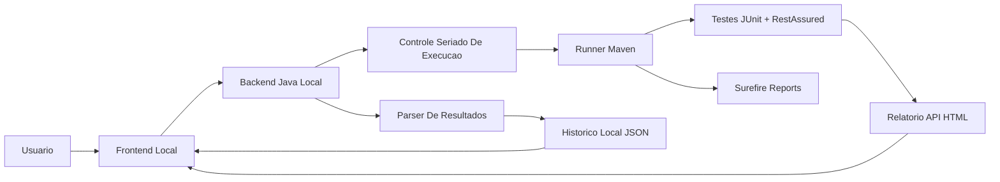

# Observatorio Local de Testes de API

## 1. Objetivo

Este documento descreve a proposta tecnica para evoluir o projeto atual de testes de API para uma aplicacao local de observabilidade, execucao e acompanhamento de suites automatizadas com JUnit e RestAssured.

A solucao proposta tem como objetivo permitir que um usuario tecnico ou nao tecnico consiga:

- iniciar execucoes de testes de API por uma interface web local;
- acompanhar o estado da execucao em tempo quase real;
- impedir execucoes concorrentes acidentais;
- consultar historico de resultados;
- visualizar graficos de saude da automacao;
- abrir relatorios detalhados de cada execucao;
- manter separacao clara entre codigo de teste e codigo do observatorio.

O observatorio sera local nesta primeira fase. Nao havera publicacao em servidor corporativo, autenticacao multiusuario ou banco de dados centralizado inicialmente.

## 2. Contexto Atual

O projeto atualmente usa:

- Java 17;
- Maven;
- JUnit 5;
- RestAssured;
- Maven Surefire;
- relatorio HTML local gerado em `target/api-report/index.html`;
- configuracao local via `src/test/resources/environments/local.properties`;
- credenciais locais via `.env`, ignorado pelo Git.

Hoje os testes podem ser executados pela linha de comando:

```bash
mvn test
```

Ou por tags:

```bash
mvn test -Dgroups=api
mvn test -Dgroups=moodle
```

Esse modelo e funcional para automacao tecnica, mas ainda nao oferece uma visao operacional consolidada para acompanhamento, apresentacao, historico e tomada de decisao.

## 3. Visao Da Solucao

A proposta e construir uma aplicacao local chamada Observatorio de Testes de API.

Ela sera composta por:

- frontend web local;
- backend Java local;
- runner Maven serializado;
- armazenamento local de historico;
- integracao com relatorios gerados pelos testes;
- camada de leitura e consolidacao de resultados.

O usuario acessara uma URL local, por exemplo:

```text
http://localhost:8080
```

Na tela, sera possivel disparar suites de teste, visualizar status da execucao atual e consultar historico de execucoes anteriores.

## 4. Principios De Arquitetura

### 4.1 Separacao Entre Teste E Observatorio

Um ponto central da arquitetura e separar claramente responsabilidades.

O codigo de teste deve continuar morando em:

```text
src/test/java
src/test/resources
```

O observatorio deve morar em:

```text
src/main/java
src/main/resources
```

Essa separacao evita que a aplicacao de observabilidade contamine a suite de testes. Os testes continuam executaveis via Maven, CI ou IDE, independentemente do observatorio.

### 4.2 Testes Continuam Sendo A Fonte Da Verdade

O observatorio nao deve implementar regras de validacao da API.

As validacoes continuam pertencendo aos testes JUnit:

- status HTTP esperado;
- contrato de resposta;
- campos obrigatorios;
- regras de negocio;
- fluxo funcional;
- asserts com Hamcrest/JUnit.

O observatorio apenas:

- dispara a execucao;
- acompanha o processo;
- coleta resultados;
- consolida metricas;
- apresenta relatorios e graficos.

### 4.3 Execucao Local E Reprodutivel

A primeira fase sera local. Isso reduz complexidade de infraestrutura e permite ganho rapido.

Premissas:

- a maquina local possui Java e Maven;
- o projeto contem o `.env` local com credenciais;
- a rede local consegue acessar os ambientes de API;
- o usuario executa o observatorio a partir da raiz do projeto.

### 4.4 Execucao Seriada

As execucoes de teste devem ser seriadas.

Isso significa que apenas uma execucao pode estar ativa por vez.

Justificativas:

- evita concorrencia sobre o diretorio `target/`;
- evita sobrescrita simultanea de relatorios;
- evita conflito de credenciais/sessoes;
- simplifica rastreabilidade;
- reduz risco de resultados inconsistentes;
- facilita diagnostico de falha.

Nesta primeira fase, a recomendacao e bloquear nova execucao quando ja houver uma em andamento.

Exemplo de comportamento:

```text
Usuario clica em Executar Suite Moodle
Sistema inicia execucao
Usuario clica novamente durante execucao
Sistema responde: "Ja existe uma execucao em andamento"
```

Uma fila de execucoes pode ser adicionada em fase futura, caso haja necessidade real.

## 5. Arquitetura Proposta

### 5.1 Diagrama Logico



### 5.2 Componentes

#### Frontend Local

Responsavel pela experiencia visual e interacao do usuario.

Responsabilidades:

- exibir status atual da execucao;
- permitir disparo de suites;
- mostrar cards de resumo;
- mostrar graficos;
- listar historico;
- disponibilizar link para relatorios detalhados;
- comunicar-se com o backend via HTTP local.

Tecnologia recomendada para a primeira fase:

- HTML;
- CSS;
- JavaScript puro;
- graficos com SVG/Canvas ou biblioteca local versionada futuramente.

Nao ha necessidade inicial de React, Angular ou Vue. A aplicacao sera pequena, local e orientada a operacao.

#### Backend Java Local

Responsavel por expor endpoints HTTP locais e orquestrar execucoes.

Responsabilidades:

- servir arquivos estaticos do dashboard;
- expor APIs internas para o frontend;
- controlar estado da execucao atual;
- disparar o Maven;
- impedir execucao concorrente;
- ler relatorios gerados;
- persistir historico local;
- disponibilizar relatorios para download/visualizacao.

Tecnologia recomendada para a primeira fase:

- Java puro com `com.sun.net.httpserver.HttpServer`.

Justificativa:

- evita introduzir Spring Boot antes de necessidade real;
- reduz dependencias;
- melhora entendimento da solucao;
- facilita execucao local;
- mantem escopo controlado.

Spring Boot pode ser avaliado futuramente se a aplicacao passar a exigir autenticacao, banco de dados, multiplos usuarios, agendamento, integracao corporativa ou APIs mais complexas.

#### Runner Maven

Responsavel por executar os testes usando o mesmo mecanismo ja conhecido pelo projeto.

Exemplos de comandos:

```bash
mvn test
mvn test -Dgroups=api
mvn test -Dgroups=moodle
```

A aplicacao Java executara esses comandos via `ProcessBuilder`.

Vantagens:

- reaproveita a estrutura atual;
- mantem JUnit/Surefire como fonte oficial;
- reduz risco tecnico;
- facilita diagnostico, pois o comando continua executavel manualmente;
- preserva compatibilidade com IDE e CI.

Desvantagens aceitas:

- cada execucao inicia um processo Maven;
- tempo de start pode ser maior;
- resultado precisa ser lido de arquivos gerados.

Para o momento atual, esse trade-off e adequado.

#### Parser De Resultados

Responsavel por consolidar o resultado da execucao.

Fontes de informacao:

- `target/surefire-reports/*.xml`;
- `target/api-report/index.html`;
- logs do processo Maven;
- codigo de saida do processo.

Dados minimos a extrair:

- total de testes;
- quantidade de testes com sucesso;
- quantidade de falhas;
- quantidade de erros;
- quantidade de ignorados;
- duracao total;
- data/hora de inicio;
- data/hora de fim;
- suite/tag executada;
- status final;
- caminho do relatorio HTML;
- trecho resumido do log.

#### Historico Local

Responsavel por preservar os resultados ao longo do tempo.

Local recomendado:

```text
.api-observatory/history.json
```

Motivo para nao usar `target/`:

- `target/` e apagado pelo `mvn clean`;
- o historico perderia valor se desaparecesse a cada limpeza;
- historico e dado operacional local, nao artefato de build.

O diretorio `.api-observatory/` deve ser adicionado ao `.gitignore`.

## 6. Estrutura De Pastas Recomendada

```text
automacao-web/
  docs/
    observatorio-testes-api.md

  src/
    main/
      java/
        observatorio/
          ApiObservatoryApplication.java
          server/
            ObservatoryServer.java
            StaticFileHandler.java
            ApiStatusHandler.java
            ApiRunHandler.java
            ApiHistoryHandler.java
            ReportHandler.java
          execution/
            TestExecutionService.java
            MavenTestRunner.java
            TestRunCommand.java
            TestRunResult.java
            TestRunStatus.java
          history/
            RunHistoryStore.java
            RunHistoryEntry.java
          reports/
            SurefireReportParser.java
            ApiReportLocator.java
          config/
            ObservatoryConfig.java

      resources/
        observatory/
          index.html
          styles.css
          app.js

    test/
      java/
        api/
          TesteAcessoMoodle.java
          MetodosPublicos.java
          support/
            ApiConfig.java
            ApiReport.java
            ApiReportExtension.java
            ApiReportFilter.java

      resources/
        environments/
          local.properties

  .env
  .gitignore
  pom.xml
  README.md
```

## 7. Fluxo De Execucao

### 7.1 Inicio Da Aplicacao

O usuario inicia o observatorio local por Maven.

Exemplo futuro:

```bash
mvn test-compile exec:java -Dexec.mainClass=observatorio.ApiObservatoryApplication
```

Ou, com configuracao dedicada no Maven:

```bash
mvn -Pobservatorio
```

O backend sobe em uma porta local:

```text
http://localhost:8080
```

### 7.2 Disparo De Teste Pelo Frontend

O usuario seleciona uma suite no dashboard.

Exemplos:

- todas as suites;
- `api`;
- `moodle`;
- futuramente `login`, `matricula`, `contrato`, `regressao`.

O frontend envia:

```http
POST /api/runs
Content-Type: application/json

{
  "suite": "moodle"
}
```

### 7.3 Controle Seriado

O backend verifica se ja existe execucao em andamento.

Se nao houver:

- cria um novo `runId`;
- marca status como `RUNNING`;
- dispara o Maven em processo separado;
- retorna `202 Accepted`.

Se ja houver:

- nao inicia novo processo;
- retorna `409 Conflict`;
- informa qual execucao esta em andamento.

### 7.4 Execucao Maven

Para suite `moodle`, o runner executa:

```bash
mvn test -Dgroups=moodle
```

Para suite `api`:

```bash
mvn test -Dgroups=api
```

Para tudo:

```bash
mvn test
```

O backend captura:

- stdout;
- stderr;
- codigo de saida;
- timestamp de inicio;
- timestamp de fim.

### 7.5 Consolidacao

Ao final do processo:

- o parser le os XMLs do Surefire;
- o backend identifica o relatorio HTML gerado;
- o historico local e atualizado;
- o status global passa para `PASSED`, `FAILED` ou `ERROR`.

### 7.6 Atualizacao Do Dashboard

O frontend consulta periodicamente:

```http
GET /api/status
GET /api/history
```

Com isso, atualiza:

- estado atual;
- cards;
- graficos;
- tabela historica;
- link do relatorio.

## 8. API Interna Do Observatorio

### 8.1 Status Atual

```http
GET /api/status
```

Resposta:

```json
{
  "running": true,
  "currentRun": {
    "runId": "20260416-164200",
    "suite": "moodle",
    "status": "RUNNING",
    "startedAt": "2026-04-16T16:42:00-03:00"
  }
}
```

### 8.2 Iniciar Execucao

```http
POST /api/runs
Content-Type: application/json

{
  "suite": "moodle"
}
```

Resposta quando aceito:

```json
{
  "runId": "20260416-164200",
  "status": "RUNNING",
  "message": "Execucao iniciada"
}
```

Resposta quando ja existe execucao:

```json
{
  "status": "BUSY",
  "message": "Ja existe uma execucao em andamento",
  "currentRunId": "20260416-164200"
}
```

### 8.3 Historico

```http
GET /api/history
```

Resposta:

```json
[
  {
    "runId": "20260416-164200",
    "suite": "moodle",
    "status": "PASSED",
    "total": 4,
    "passed": 4,
    "failed": 0,
    "errors": 0,
    "skipped": 0,
    "durationMs": 2594,
    "startedAt": "2026-04-16T16:42:00-03:00",
    "finishedAt": "2026-04-16T16:42:03-03:00",
    "reportUrl": "/reports/20260416-164200/index.html"
  }
]
```

### 8.4 Detalhe De Uma Execucao

```http
GET /api/runs/{runId}
```

Resposta:

```json
{
  "runId": "20260416-164200",
  "suite": "moodle",
  "status": "PASSED",
  "command": "mvn test -Dgroups=moodle",
  "exitCode": 0,
  "total": 4,
  "passed": 4,
  "failed": 0,
  "errors": 0,
  "skipped": 0,
  "durationMs": 2594,
  "reportUrl": "/reports/20260416-164200/index.html",
  "logSummary": "Tests run: 4, Failures: 0, Errors: 0, Skipped: 0"
}
```

## 9. Modelo De Status

Status de execucao:

```text
PENDING
RUNNING
PASSED
FAILED
ERROR
BLOCKED
```

Significados:

- `PENDING`: execucao registrada, mas ainda nao iniciada. Uso futuro se houver fila.
- `RUNNING`: Maven em execucao.
- `PASSED`: Maven finalizou com sucesso e nao houve falhas nos testes.
- `FAILED`: Maven finalizou, mas houve falha, erro ou teste quebrado.
- `ERROR`: falha tecnica na infraestrutura de execucao, por exemplo Maven indisponivel.
- `BLOCKED`: solicitacao recusada porque ja havia execucao em andamento.

Na primeira fase, o fluxo principal usara:

```text
RUNNING -> PASSED
RUNNING -> FAILED
RUNNING -> ERROR
```

## 10. Relatorios E Graficos

### 10.1 Relatorio Detalhado

O relatorio detalhado continuara sendo gerado pelos testes em:

```text
target/api-report/index.html
```

Para manter historico por execucao, o observatorio deve copiar esse relatorio para:

```text
.api-observatory/reports/{runId}/index.html
```

Isso evita que uma nova execucao sobrescreva a evidencia anterior.

### 10.2 Graficos Propostos

Graficos para a primeira fase:

- resultado por execucao;
- tendencia de sucesso/falha;
- duracao por execucao;
- quantidade de testes por status;
- ultimas execucoes por suite.

Exemplos de indicadores:

```text
Taxa de sucesso = execucoes PASSED / total de execucoes
Tempo medio = media de durationMs
Falhas recentes = execucoes FAILED nas ultimas N rodadas
Estabilidade = percentual de execucoes bem-sucedidas por suite
```

### 10.3 Cards De Resumo

Cards recomendados:

- ultima execucao;
- status atual;
- total de testes da ultima execucao;
- passados;
- falhados;
- ignorados;
- tempo total;
- taxa de sucesso historica.

## 11. Persistencia Local

### 11.1 Arquivos

Estrutura recomendada:

```text
.api-observatory/
  history.json
  runs/
    20260416-164200.json
  reports/
    20260416-164200/
      index.html
```

### 11.2 `history.json`

Arquivo consolidado usado para carregar rapidamente o dashboard.

Exemplo:

```json
[
  {
    "runId": "20260416-164200",
    "suite": "moodle",
    "status": "PASSED",
    "total": 4,
    "passed": 4,
    "failed": 0,
    "errors": 0,
    "skipped": 0,
    "durationMs": 2594,
    "startedAt": "2026-04-16T16:42:00-03:00",
    "finishedAt": "2026-04-16T16:42:03-03:00",
    "reportPath": ".api-observatory/reports/20260416-164200/index.html"
  }
]
```

### 11.3 Arquivo Individual Por Execucao

Cada execucao pode ter um arquivo dedicado:

```text
.api-observatory/runs/{runId}.json
```

Esse arquivo pode conter dados mais detalhados:

- comando Maven;
- logs resumidos;
- ambiente;
- erro tecnico;
- paths de relatorios;
- metricas extraidas do Surefire.

## 12. Seguranca E Dados Sensiveis

Mesmo sendo local, a solucao deve seguir boas praticas.

Regras:

- `.env` nao deve ser versionado;
- `.api-observatory/` nao deve ser versionado;
- `target/` nao deve ser versionado;
- tokens nao devem aparecer em logs persistidos;
- headers sensiveis devem ser mascarados;
- URLs com parametros sensiveis devem ser redigidas no relatorio quando possivel.

Dados sensiveis comuns:

```text
Authorization
token
refresh
senha
password
cookie
set-cookie
```

O relatorio atual ja aplica redacao para varios desses campos. O observatorio deve preservar essa politica.

## 13. Configuracao

### 13.1 `.env`

Arquivo local:

```bash
PORTAL_LOGIN="usuario"
PORTAL_SENHA="senha"
```

O projeto tambem aceita:

```bash
export PORTAL_LOGIN="usuario"
export PORTAL_SENHA="senha"
```

### 13.2 Configuracao Do Ambiente De API

Arquivo:

```text
src/test/resources/environments/local.properties
```

Exemplo:

```properties
api.baseUri=https://erp-api-prod-964330493122.southamerica-east1.run.app
api.report.maxBodyChars=6000
```

### 13.3 Configuracao Do Observatorio

Pode ser adicionada futuramente em:

```text
src/main/resources/observatory.properties
```

Exemplo:

```properties
observatory.host=localhost
observatory.port=8080
observatory.historyDir=.api-observatory
observatory.mavenCommand=mvn
```

## 14. Execucao Prevista

Comando inicial recomendado:

```bash
mvn test-compile exec:java -Dexec.mainClass=observatorio.ApiObservatoryApplication
```

Melhoria planejada:

```bash
mvn -Pobservatorio
```

Esse perfil Maven pode:

- compilar testes;
- iniciar a aplicacao;
- configurar classpath necessario;
- reduzir complexidade operacional para o usuario.

## 15. Decisoes Tecnicas Propostas

| Tema | Decisao | Justificativa |
| --- | --- | --- |
| Escopo inicial | Local | Reduz infraestrutura e acelera validacao |
| Disparo dos testes | Backend executa Maven | Reaproveita fluxo atual e reduz risco |
| Concorrencia | Uma execucao por vez | Evita conflito em `target/` e relatorios |
| Fila | Nao na primeira fase | Simplicidade operacional |
| Backend | Java puro com `HttpServer` | Baixa complexidade e poucas dependencias |
| Frontend | HTML/CSS/JS puro | Suficiente para dashboard local |
| Historico | JSON em `.api-observatory/` | Simples, auditavel e local |
| Relatorio detalhado | Reaproveitar `target/api-report` | Evita duplicar trabalho |
| Graficos | Frontend baseado em historico JSON | Rapido e sem dependencia externa inicial |

## 16. Beneficios Esperados

Beneficios tecnicos:

- padronizacao da execucao de testes;
- reducao de dependencias manuais;
- melhor rastreabilidade;
- preservacao de evidencias;
- visibilidade historica de estabilidade;
- separacao entre automacao e observabilidade.

Beneficios para gestao:

- visao consolidada da qualidade das APIs;
- indicadores simples para acompanhamento;
- demonstracao visual de evolucao;
- reducao de atrito para apresentar resultados;
- base para maturidade futura em CI/CD e qualidade continua.

## 17. Riscos E Mitigacoes

| Risco | Impacto | Mitigacao |
| --- | --- | --- |
| Falha de rede local | Testes podem falhar mesmo com codigo correto | Evidenciar erro tecnico no dashboard |
| Maven indisponivel | Observatorio nao consegue executar testes | Validacao de pre-requisitos na inicializacao |
| Sobrescrita de relatorios | Perda de evidencia historica | Copiar relatorio por `runId` |
| Vazamento de tokens | Exposicao de dados sensiveis | Redacao em logs e relatorios |
| Execucao concorrente | Resultado inconsistente | Bloqueio de nova execucao durante `RUNNING` |
| Crescimento do historico | Lentidao no carregamento | Paginacao/limite em fase futura |

## 18. Roadmap

### Fase 1 - MVP Local

- servidor local Java;
- dashboard web simples;
- botao para executar suite;
- bloqueio de execucao concorrente;
- runner Maven;
- parser Surefire;
- historico JSON;
- cards de resumo;
- graficos basicos;
- link para relatorio HTML.

### Fase 2 - Melhorias Operacionais

- selecao de ambiente;
- selecao multipla de tags;
- logs em tempo real na tela;
- comparativo entre execucoes;
- filtro por status/suite/data;
- exportacao de historico em CSV/JSON;
- limpeza controlada de historico antigo.

### Fase 3 - Maturidade Tecnica

- agendamento local;
- integracao opcional com CI;
- publicacao de relatorios;
- base de dados local leve, como SQLite;
- autenticacao caso vire compartilhado;
- migração para Spring Boot se houver necessidade.

## 19. Criterios De Aceite Do MVP

O MVP sera considerado concluido quando:

- o observatorio iniciar localmente por comando Maven;
- o dashboard abrir no navegador;
- houver botao para executar pelo menos a suite `moodle`;
- uma segunda execucao for bloqueada enquanto a primeira estiver em andamento;
- ao final da execucao, o resultado aparecer no dashboard;
- o historico for salvo em `.api-observatory/history.json`;
- o dashboard exibir pelo menos dois graficos;
- o relatorio detalhado puder ser aberto pelo navegador;
- os testes continuarem executaveis via `mvn test` independentemente do observatorio.

## 20. Conclusao

A abordagem proposta preserva o investimento ja feito na automacao com JUnit e RestAssured, sem criar acoplamento indevido entre testes e interface visual.

O observatorio atua como uma camada operacional sobre a suite existente. Ele nao substitui os testes, nao redefine validacoes e nao cria dependencia obrigatoria para execucao via Maven ou CI.

Essa arquitetura permite uma primeira entrega local, simples e demonstravel, com potencial claro de evolucao para um modelo mais robusto de qualidade continua e observabilidade de APIs.
